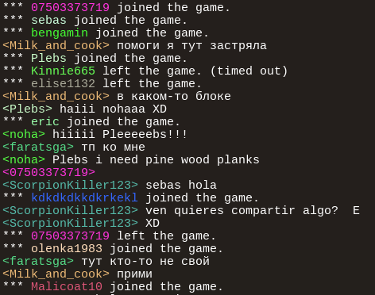

# Colored Names

## Description

This is a client-side mod (CSM) for Luanti/Minetest.

It colorizes the nicknames in-game to keep track of people more easily. This mod supports the default chat format
as well as a few server-specific formats. Chat lines where the format could not be detected are kept untouched.

Caveats:

 * This mod works on servers using the default value of the setting `csm_restriction_flags`.
   However, it cannot work if client mods are prohibited from loading by the `LOAD_CLIENT_MODS` flag.
   If that is the case, do contact the server admin.
 * Not all chat-modifying mods are supported.
 * Not all chat command responses are supported. Responses that are marked for translation in
   the sense of `S("foo @1 bar", playername)` should generally be colorized.

License: MIT

Forum topic: https://forum.luanti.org/viewtopic.php?t=19964

## Installation

Relevant docs page: https://docs.luanti.org/for-players/installing-client-side-mods/

1. Luanti main menu -> "About" tab -> click the "Open user data directory" button
    * You should see the directory that contains the main `minetest.conf` file.
2. Close all Luanti processes
3. (Create and) open the directory `LUANTI_DIR/clientmods`
4. `git clone https://github.com/SmallJoker/colored_names.git --depth 1`
    * Alternatively, do extract the downloaded repo archive into the directory.
5. (Create and) open the file `LUANTI_DIR/clientmods/mods.conf`
6. Add or update the line `load_mod_colored_names = true`
7. Start Luanti and play
